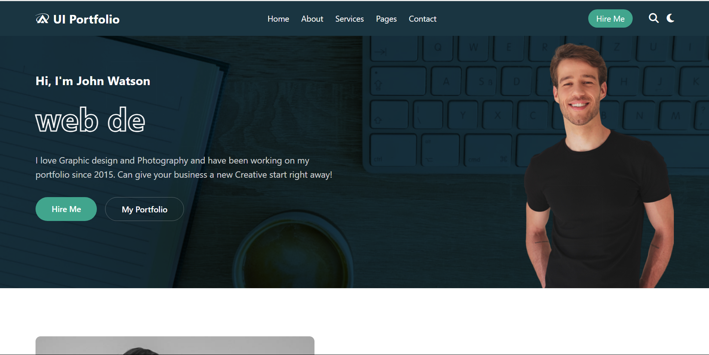

# Web Development — Assignment 2

A multi‑page **HTML + CSS + JavaScript** website created for the second Web‑Dev coursework assignment. It demonstrates a modern, mobile‑first design with dedicated pages for **Home**, **About**, **Services**, and **Contact**.

## 

## ✨ Highlights

- **Responsive** layout (Flexbox & CSS Grid)
- Automatic **dark‑mode** with CSS custom‑property theming
- Home‑page **count‑up** animation & subtle scroll effects
- Clean, semantic markup & accessible navigation
- No build tools — just open the HTML files in any browser

---

## 📂 Project structure

```text
.
├── Home/
│   ├── main.html
│   ├── main.css
│   └── main.js
├── About/
│   ├── about.html
│   └── about.css
├── Services/
│   ├── services.html
│   └── services.css
├── Contact/
│   ├── contact.html
│   └── contact.css
├── images/
│   └── … (SVGs & JPGs used across pages)
├── theme.css         # global colour palette & variables
├── script.js         # shared JS helpers
└── README.md         # you are here ✅
```

---

## 🚀 Quick start

```bash
# 1️⃣ Clone the repo
$ git clone https://github.com/MuganziJames/WEB-DEVELOPMENT-ASSIGNMENT-2.git

# 2️⃣ Open the Home page (or any page!)
$ cd WEB-DEVELOPMENT-ASSIGNMENT-2/Home
$ start "" main.html       # Windows
# or
$ open main.html            # macOS
# or
$ xdg-open main.html        # Linux
```

> **Tip:** Run a small local server (e.g. `npx serve`) for cleaner in‑browser navigation if you prefer.

---

## 🛠️ Tech stack

| Tech                      | Purpose                             |
| ------------------------- | ----------------------------------- |
| **HTML5**                 | Semantic structure                  |
| **CSS3**                  | Styling & animations                |
| **JavaScript (ES6)**      | Interactivity                       |
| **Flexbox & CSS Grid**    | Responsive layout                   |
| **CSS Custom Properties** | Light/dark & Home deep‑teal theming |

---

## ✍️ Customising

- **Colours** — edit `theme.css`; the special Home deep‑teal palette lives under `body.home.dark`.
- **Content** — update the HTML inside each page folder.
- **Images** — place new assets in `images/` and adjust `` paths.

---

## 🤝 Contributing

1. **Fork** the repo
2. Create your branch: `git checkout -b feature/awesome-feature`
3. **Commit** your changes: `git commit -m "Add awesome feature"`
4. **Push** to the branch: `git push origin feature/awesome-feature`
5. **Open a Pull Request**

---

## 📜 License

Released under the **MIT License** — see [`LICENSE`](LICENSE) for full text.

---

> Crafted with 💻 & ☕ by **Jude Fabiano Imoli**.
